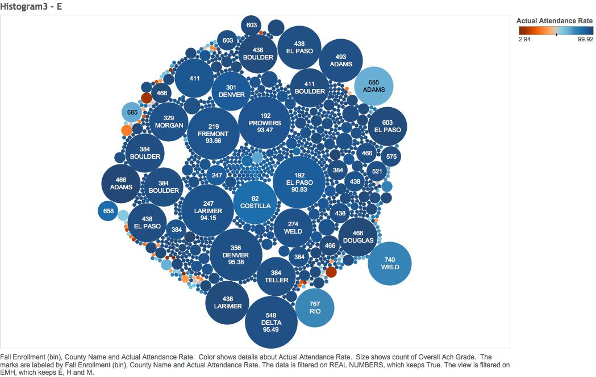
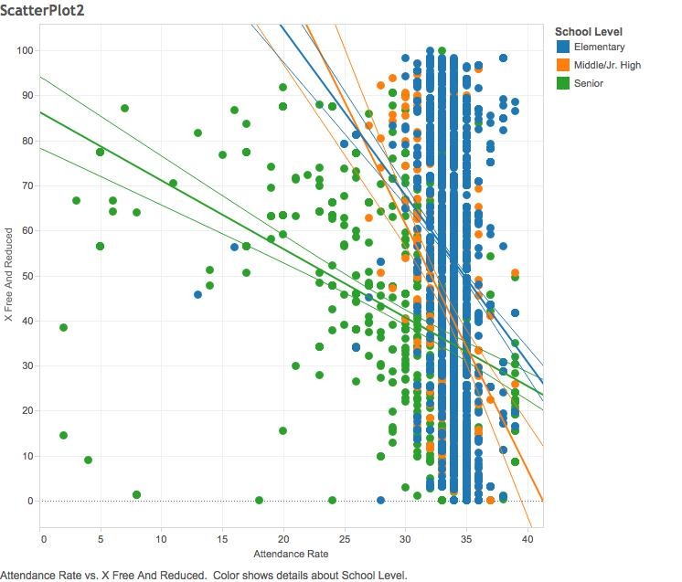
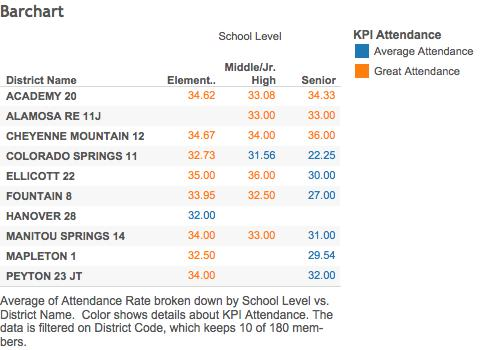
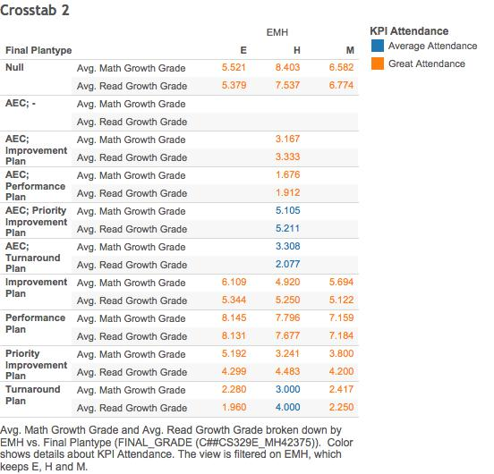

```{r, include=FALSE}
require(tidyr)
require(dplyr)
require(ggplot2)
require (jsonlite)
require (RCurl)
require (scales)
```  

##**Introduction**
Many go through the education system without noticing the trends and patterns that appear throughout different schools. The programs a school offers its students as well as teachers and peers can influence a student's academic development. In our presentation, we discuss just some of the patterns that we noticed while doing out project. To demonstrate our findings, we will be using R Studio, SQL, Tableau, and Shiny. 

##**Step 1: Loading Data into Oracle Database**
For our project, we included four different datasets. 

Our first dataset displays the different schools and their varying Math, Reading, and Writing grades as well as their growth rates. It also includes both initial and final plantypes that schools adopt while educating their students in A schools, elementaries, middle schools, and high schools. We used the code below to extract, transform, and load the data into an sql statement:   
```{r, eval=FALSE}
source("../01 Data/ETL.R")
```

Our second dataset focused on the free and reduced lunches that the schools had to offer. The code we used was:
```{r, eval=FALSE}
source("../01 Data/ETL_2.R")
```
  
Our third dataset depicted the distribution of ethnic employees working at the schools. Our code is listed below:
```{r, eval=FALSE}
source("../01 Data/ETL_3.R")
```

Lastly, our final dataset gives a clear depiction of the attendance and truancy rates at schools. We used the code below:
```{r, eval=FALSE}
source("../01 Data/ETL_4.R")
```

##**Visualizations**
To create our visualizations, we started out creating them in Tableau and playing around with different options to find a meaningful visualization. Then, we attempted to replicated them in R Studio, SQL, and Shiny. 

###**Tableau**
####**Histogram:**


####**Scatter Plot:**


####**Crosstab: The effects of attendance**
  
  
This crosstab shows the attendance rates of elementary, middle, high schools in 10 districts. We looked at a select number of districts to narrow down the information, so we filtered out schools that weren't in districts 1-10. From the crosstab, we see that the majority of the schools in these 10 districts tend to have higher attendance rates, and none of these schools have bad attendance.  

We then looked at the relationship between the average attendance rate and the reading and math growth rate in different types of educational plantypes.  
  
 
  
From this crosstab, we can see that there tends to be a slight effect on both the math and reading growth rate when the attendance is higher (orange). However, there are still several outliers that don't fit in as well such as the turnaround plan in elementary schools and the performance plan in high schools. These differences would probably be due to outside factors such as faculty quality or socioeconomic status.  

###**Shiny**

##**Conclusion**

