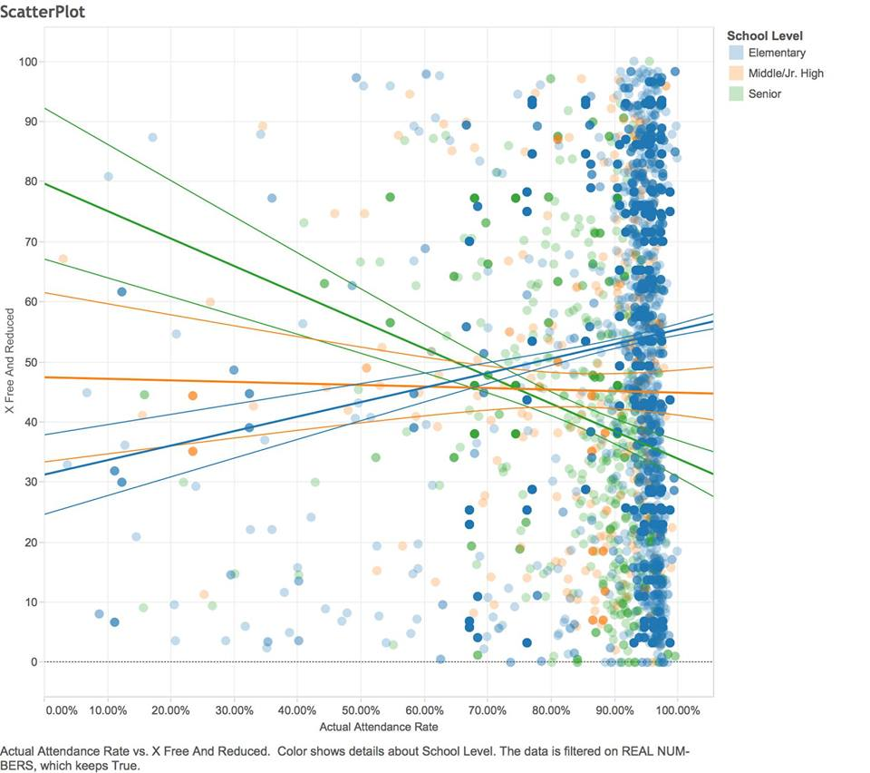
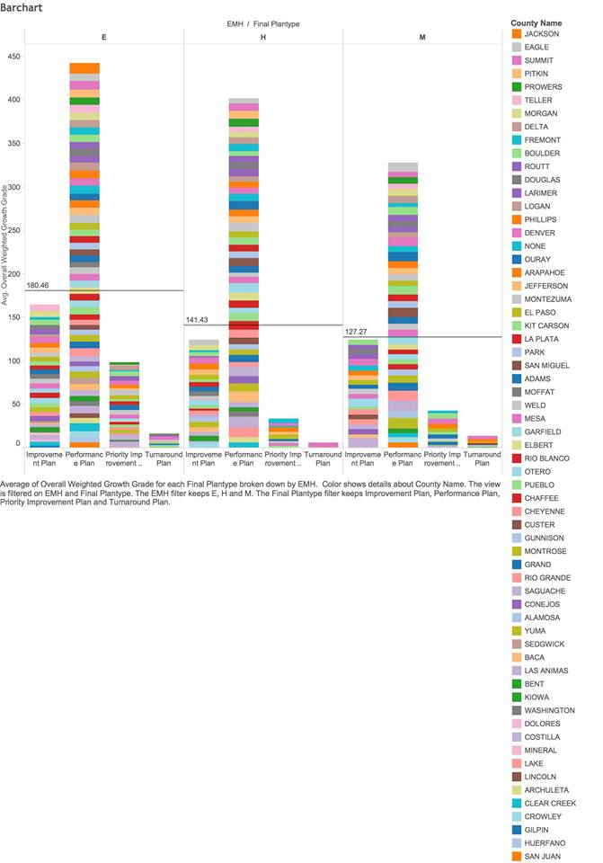

```{r, include=FALSE}
require(tidyr)
require(dplyr)
require(ggplot2)
require (jsonlite)
require (RCurl)
require (scales)
```  

##**Introduction**
Many go through the education system without noticing the trends and patterns that appear throughout different schools. The programs a school offers its students as well as teachers and peers can influence a student's academic development. In our presentation, we discuss just some of the patterns that we noticed while doing out project. To demonstrate our findings, we will be using R Studio, SQL, Tableau, and Shiny. 

##**Step 1: Loading Data into Oracle Database**
For our project, we included four different datasets. 

Our first dataset displays the different schools and their varying Math, Reading, and Writing grades as well as their growth rates. It also includes both initial and final plantypes that schools adopt while educating their students in A schools, elementaries, middle schools, and high schools. We used the code below to extract, transform, and load the data into an sql statement:   
```{r, eval=TRUE}
source("../01 Data/ETL.R")
```

Our second dataset focused on the free and reduced lunches that the schools had to offer. The code we used was:
```{r, eval=FALSE}
source("../01 Data/ETL_2.R")
```
  
Our third dataset depicted the distribution of ethnic employees working at the schools. Our code is listed below:
```{r, eval=FALSE}
source("../01 Data/ETL_3.R")
```

Lastly, our final dataset gives a clear depiction of the attendance and truancy rates at schools. We used the code below:
```{r, eval=FALSE}
source("../01 Data/ETL_4.R")
```

##**Visualizations**
To create our visualizations, we started out creating them in Tableau and playing around with different options to find a meaningful visualization. Then, we attempted to replicated them in R Studio, SQL, and Shiny. 

###**Tableau**
####**Histogram: The effects of big school size on overall achievement**

  
Our histogram shows the relationship between the bigger fall enrollment numbers and the overall achievement grade. The size of the bubble depicts the overall achievement grade, and we can see that many of the larger bubbles seem to be from the same district. This graph was interesting because it showed that there didn't really seem to be a relationship between the size of a school and the overall achievement rate. However, we thought it was interesting that many of the highest achieving schools are in bigger cities such as Denver and Boulder that have more opportunities for higher education. This can be due to the fact that students may be more driven because they want to attend these schools. 

####**Scatter Plot: The effects of free and reduced lunches on attendance**
  
  
Our scatter plot shows the relationship between the rate of free and reduced lunches and attendance rates among elementary, middle school, and high school. From our plot, we noticed that the majority of the elementary schools and even the middle/jr. high schools seemed to congregate around 90-100% attendance rate, while the senior high schools seemed to be more widespread and lacked a consistent attendence rate. 
  
We noticed that there was a positive correlation between the number of free and reduced lunches and the attendance rates primarily in elementary schools and no correlation with senior high schools. We concluded that this might have been due to the fact that families that need free and reduced lunches are of lower socioeconomic statuses, and cannot afford to feed their children as well as they would like. Thus, it would make sense to want to send them to school. Another factor that could affect this rate would be that senior high schools are capable of taking care of themselves and making their own decisions, so they can skip school whenever they want.  

####**Crosstab: The effects of attendance on learning**
  
  
This crosstab shows the attendance rates of elementary, middle, high schools in 10 districts. We looked at a select number of districts to narrow down the information, so we filtered out schools that weren't in districts 1-10. We noticed that most schools tended to range from lower 20s to the higher 30s. Thus, we set the our first KPI indicator of bad attendance to be any school with a average attendance rate of lower than 20. We set the average attendance rate to school's whose average attendance rate fell between 20 and 32, and everything above 32 was considered great attendance. From the crosstab, we see that the majority of the schools in these 10 districts tend to have higher attendance rates, and none of these schools have bad attendance.

We then looked at the relationship between the average attendance rate and the reading and math growth rate in different types of educational plantypes.  
  
 
  
From this crosstab, we can see that there tends to be a slight effect on both the math and reading growth rate when the attendance is higher (orange). However, there are still several outliers that don't fit in as well such as the turnaround plan in elementary schools and the performance plan in high schools. These differences would probably be due to outside factors such as faculty quality or socioeconomic status.  

####**Barchart: The effects plantype on achievement**


This shows the relationship between final plantype and overall achievement for elementary, middle, high shcool. It's interesting that across the board, performance plan had the greatest achievement rate. It's colored by counties and those are sorted by average achievement rate to show which county was the highest performing for each of the school levels. We didn't see any correlation between specific counties and having a very high achievement.  

###**Shiny**
https://rarthur.shinyapps.io/DV_FinalProject

##**Conclusion**
Throughout this class, we have both learned a lot of of analytical skills as well as the technical skills that go behind creating a meaningful visualization. We now have experience filtering through good and bad datasets, blending them to make more meaningful connections, and displaying them in a user friendly way.
